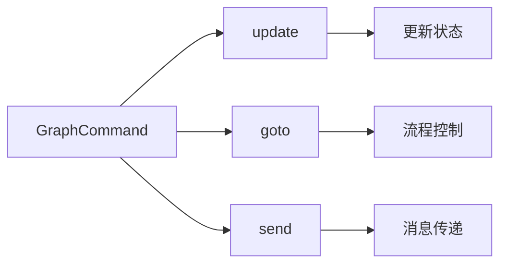
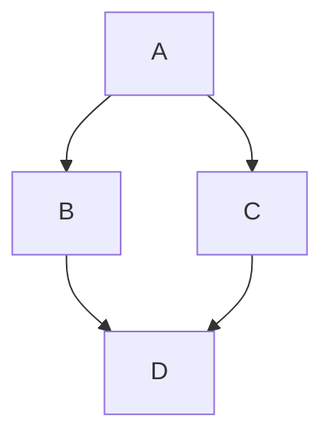
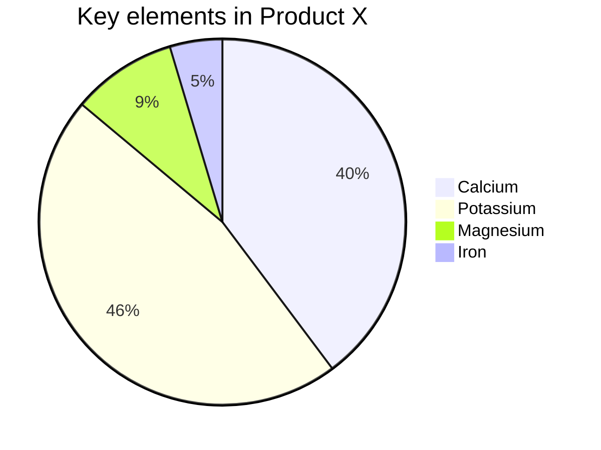
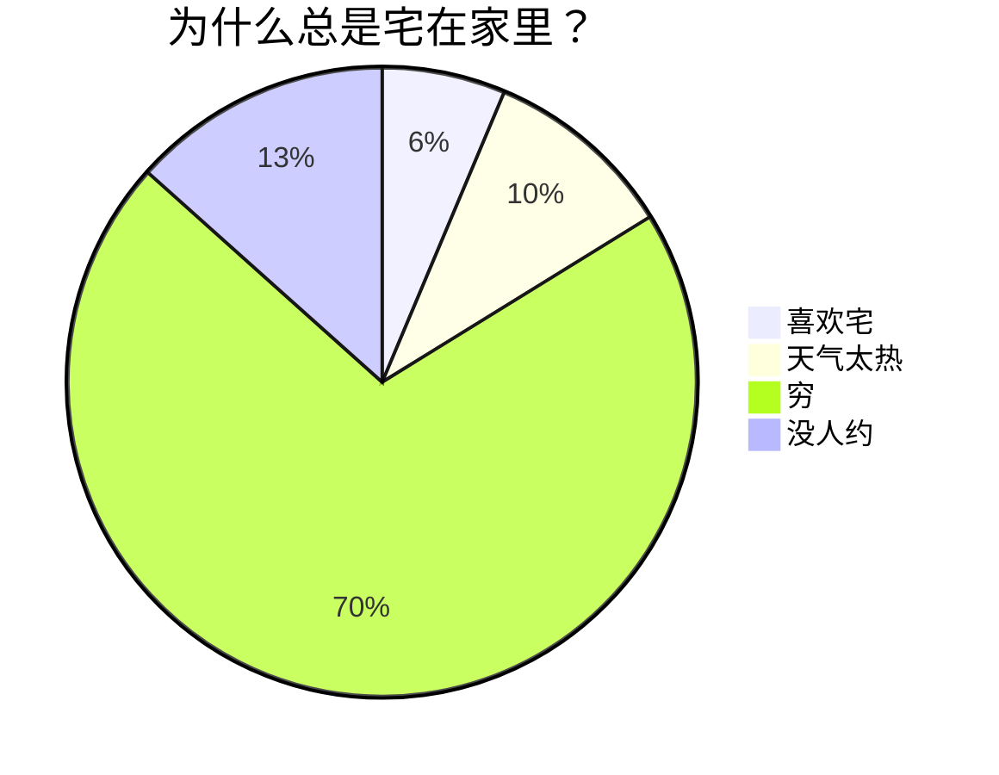
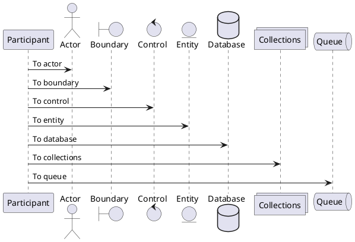

# 彻底告别环境污染！Xvenv：一个 BAT 脚本极速拉起免安装全栈开发环境

在日常开发中，我们几乎都经历过以下“噩梦”




>中，我们几乎都经历过以下“噩梦”在日常开发中，我们几乎都经历过以下“噩梦”在日常开发中，我们几乎都经历过以




>中，我们几乎都经历过以下“噩梦”在日常开发中，我们几乎都经历过以下“噩梦”在日常开发中，我们几乎都经历过以






 





``` {linenos=inline,hl_lines=[12,"14-17"]}
#噩噩噩噩噩噩噩噩噩噩噩噩噩噩噩噩噩噩噩噩噩噩噩噩噩噩噩噩噩噩噩噩噩噩噩噩
import re  # Launch IDEs
from typing import Dict, List, Optional, Pattern, Tuple  # Launch
# Launch IDEs
# Launch IDEse dfsgdfg saergsdfgs gsdfg serg sdfg 
Classification = Dict[str, Optional[object]]  # Launch IDEs
#噩噩噩噩噩噩噩噩噩噩噩噩噩噩噩噩噩噩噩噩噩噩噩噩噩噩噩噩噩噩噩噩噩噩噩噩
```



 

sadfe [yanglbme](https://github.com/yanglbme)  在日常开发中，我们几乎都经历过以下“噩梦”在日常开发中，我们几乎都经历过以下“噩梦”在日常开发中，我们几乎都经历过以下“噩梦”在日常开发中，我们几乎都经历过以下“噩梦”在日常开发中，我们几乎都经历过以下“噩梦”在日常开发中，我们几乎都经历过以下“噩梦”在日常开发中，我们几乎都经历过以下“噩梦”在日常开发中，我们几乎都经历过以下“噩梦”在日常开发中，我们几乎都经历过以下“噩梦”在日常开发中，我们几乎都经历过以下“噩梦”在日常开发中，我们几乎都经历过以下“噩梦”在日常开发中，我们几乎都经历过以下“噩梦”在日常开发中，我们几乎都经历过以下“噩梦”在日常开发中，我们几乎都经历过以下“噩梦”




在日常开发中，我们几乎历过以下“噩梦”时刻：


- 无序列表项 1
  - 嵌套有序列表项 1
  - 嵌套有序列表项 2

- 无序列表项 2
  1. 有序列表项 1
  2. 有序列表项 2

在日常开发中，我们几乎历过以下“噩梦”时刻：


>在日常开发中，我们几乎都经历过以下“噩梦”在日常开发中，我们几乎都经历过以下“噩梦”在日常开发中，我们几乎都经历过以下“噩梦”在日常开发中，我们几乎都经历过以下“噩梦”在日常开发中，我们几乎都经历过以下“噩梦”在日常开发中，我们几乎都经历过以下“噩梦”在日常开发中，我们几乎都经历过以下“噩梦”在日常开发中，我们几乎都经历过以下“噩梦”在日常开发中，我们几乎都经历过以下“噩梦”在日常开发中，我们几乎都经历过以下“噩梦”在日常开发中，我们几乎都经历过以下“噩梦”在日常开发中，我们几乎都经历过以下“噩梦”在日常开发中，我们几乎都经历过以下“噩梦”在日常开发中，我们几乎都经历过以下“噩梦”在日常开发中，我们几乎都经历过以下“噩梦”在日常开发中，我们几乎都经历过以下“噩梦”在日常开发中，我们几乎都经历过以下“噩梦”

在日常开发中，我们几乎历过以下“噩梦”时刻：

```python {linenos=inline,hl_lines=[12,"14-17"]}
import re  # Launch IDEs
from typing import Dict, List, Optional, Pattern, Tuple  # Launch IDEs
# Launch IDEs
# Launch IDEse dfsgdfg saergsdfgs gsdfg serg sdfg 
Classification = Dict[str, Optional[object]]  # Launch IDEs


# Launch IDEse dfsgdfg saergsdfgs gsdfg serg sdfg 

def _default_rules() -> List[Tuple[Pattern[str], Classification]]:
    return [
        (re.compile(r"401\s+Unauthorized", re.IGNORECASE), {"ban_info": "401 Unauthorized", "is_active": False}), 
        (re.compile(r"403\s+Forbidden", re.IGNORECASE), {"ban_info": "403 Forbidden", "is_active": False}),
    ]


def classify_message(message: str, custom_rules: Optional[List[Tuple[Pattern[str], Classification]]] = None) -> Classification:
    if message is None:
        return {"ban_info": None, "is_active": None}

    rules = custom_rules if custom_rules is not None else _default_rules()
    for pattern, result in rules:
        if pattern.search(message):
            return {"ban_info": result.get("ban_info"), "is_active": result.get("is_active")}

    return {"ban_info": None, "is_active": None}
```
在日常开发中，我们几乎历过以下“噩梦”时刻：


注：说明文字

```python {linenos=inline,hl_lines=[12,"14-17"]}
#噩噩噩噩噩噩噩噩噩噩噩噩噩噩噩噩噩噩噩噩噩噩噩噩噩噩噩噩噩噩噩噩噩噩噩噩
import re  # Launch IDEs
from typing import Dict, List, Optional, Pattern, Tuple  # Launch IDEs
# Launch IDEs
# Launch IDEse dfsgdfg saergsdfgs gsdfg serg sdfg 
Classification = Dict[str, Optional[object]]  # Launch IDEs
```
注：说明文字

| 项目人员                                    | 邮箱                   | 微信号       |
| ------------------------------------------- | ---------------------- | ------------ |
| [yanglbme](https://github.com/yanglbme)     | contact@yanglibin.info | YLB0109      |

在日常开发中，我们几乎历过以下“噩梦”时刻：


```python {linenos=inline,hl_lines=[12,"14-17"]}
#噩噩噩噩噩噩噩噩噩噩噩噩噩噩噩噩噩噩噩噩噩噩噩噩噩噩噩噩噩噩噩噩噩噩噩噩
import re  # Launch IDEs
from typing import Dict, List, Optional, Pattern, Tuple  # Launch IDEs
# Launch IDEs
# Launch IDEse dfsgdfg saergsdfgs gsdfg serg sdfg 
Classification = Dict[str, Optional[object]]  # Launch IDEs
```

在日常开发中，我们几乎历过以下“噩梦”时刻：


>在日常开发中，我们几乎历过以下“噩梦”时刻：

>asdf
>sdf 


在日常开发中，我们几乎都经历过以下“噩梦”


```
asdfef
```

>asdf

```
asdfef
```


```
asdfef
```


在日常开发中，我们几乎历过以下“噩梦”时刻：


## a啊手动阀

* **系统环境严重污染**：为了跑不同项目，装了无数个 Python、Node、Go 版本，PATH 环境变量乱成一锅粥，甚至出现版本冲突，排查起来令人抓狂。
* **难以忍受的 C++ 编译链**：为了写点 Rust 甚至搞点 C++ 扩展，被迫安装动辄十几 GB 的 Visual Studio，不仅下载巨慢，卸载还会残留一堆注册表垃圾。
* **令人精分的 Git 身份管理**：白天写公司项目，晚上搞开源，一个不留神就把公司邮箱 Commit 到了 Github 上，或者多个Github账号来回切换连SSH Key 都配不明白，然后去修改仓库权限。
* **团队协作卡在第一步**：新同事入职，花半天时间看文档“配置开发环境”，结果因为系统环境差异各种报错，“在我电脑上明明能跑”成了千古魔咒。

想要一个**不改系统 PATH**、**不用安装臃肿 VS**、**不做任何系统修改**、一个项目一套环境，即插即用的随身开发工具箱？

>asdf

介绍一下我的开源工具 —— **Xvenv**，它用最复古的形式（一个单批处理文件），解决了最现代的开发环境隔离问题。


介绍一下我的开源工
# 什么是 Xvenv？

一个极简的 **.bat单文件脚本**（`xvenv.cmd`，内部使用 Bat + PowerShell 混编(Polyglot)技术，无需任何外部依赖）。

你可以把它复制多份，放到不同的项目/目录中，然后只需双击，它就会**一键下载、解压、并以免安装方式配置好所有所需的开发环境**。所有文件、环境设置…都被锁定在它自身所在目录的`.xvenv`文件夹中。下次双击，会拉起一个加载了所有所需环境配置的专用终端，你的系统依然洁白如新。

若同时运行多个不同目录的`xvenv.cmd`，它们之间亦是完全独立，互不影响。


## 强大且纯粹的核心功能模块

Xvenv 的哲学是“按需拼装”。只需在脚本顶部指定你需要的模块名，它就会自动为你搭建好以下支持的环境：

### 【msvc】免安装极速 C++ 编译链
**痛点**：只是想编译一个 Rust 项目或者装个带有 C 扩展的 Python 包，却要被逼着下几十 GB 的 Visual Studio ？


**Xvenv 方案**：它是 Xvenv 的核心“黑魔法”。脚本会直接解析微软官方的离线 Manifest，精准提取并下载组装 C++ 头文件、库和工具链组件。**完全不需要 Visual Studio**，几分钟内生成一个纯绿色的 MSVC 环境。

### 【rust】局部隔离的 Rustup 与 Cargo
由于依赖了上述的便携化 MSVC，Xvenv 可以将整个 Rust 工具链（包括 `CARGO_HOME` 和 `RUSTUP_HOME`）完全限制在自身同目录的.xvenv/中，从此告别系统全局的 `.cargo` 满目疮痍。

### 【uv】与【uv_python】下一代极速 Python 环境
**痛点**：`pip install` 太慢？`virtualenv` 经常激活错位？
**Xvenv 方案**：摒弃传统方案，内置集成爆火的 Rust 编写利器 `uv`。以毫秒级速度下载依赖、管理虚拟环境，并可指定的Python 版本。

### 【bun】极致性能的 Node.js 替代品
前端和全栈开发必备。采用极其迅捷的 `Bun` 替代传统 Node + npm 组合，提供更快的包安装速度和极低的运行开销。无论写 TS 还是 JS 都更加清爽。

### 【go】绿色版 Go 语言环境
自动下载官方的免安装版 Go 压缩包，并将`GOROOT`和`GOPATH`精准指向自身同目录的.xvenv/，所有的第三方包也都会跟随，做到项目级隔离。

### 【git】与【git_config】终极多重身份管理
**痛点**：跨项目切换 Author 经常忘，SSH 密钥配置容易乱。
**Xvenv 方案**：`git` 模块提供免安装的便携版 MinGit。而`git_config`则堪称神器——你可以直接在脚本里为**当前项目**写死`Git Author`、`Email`甚至专属的`SSH_COMMAND`指定不同ssh key，让你在该项目中**永远不可能提交错身份**。

### 【vscode】与【pwsh】无缝沉浸式开发体验
`pwsh` 模块会自动下载运行 PowerShell 7。`vscode` 模块会自动为项目生成 `.vscode/settings.json`：把 Python 解释器路径、Go root 以及默认终端全部硬链接到隔离出来的`.xvenv`环境。下次启动 VSCode，环境开箱即用。

### 【env_load】自动加载环境变量
开启后，在启动终端前自动读取项目根目录的`.env`文件，将环境变量完美注入当前专用终端，避免手动 set。


## 开箱即用：推荐项目配置示例

使用 Xvenv 极其简单，①将 `xvenv.cmd` 放入工程目录；②编辑脚本顶部的 `$_xvenv_modules` ；③双击。

### 示例 1：纯粹的 Python 极速开发环境
适合做数据分析、爬虫或后端 API 开发。秒建虚拟环境，再也不用担心全局依赖冲突。
```powershell
$_xvenv_modules = @( 
    "uv", 
    "uv_python", 
    "uv_sync",   # 自动根据 pyproject.toml 同步依赖胜多负少发射点发射点
    "vscode", 
    "env_load" 
)
```

### 示例 2：现代化全栈前端项目 (Bun + 独立Git身份)
适合接私活或开源协作，保证 Node 环境纯净，且默认注入你的开源马甲身份。
```powershell
# 修改脚本中的 Git 变量
$GIT_AUTHOR_NAME  = "MyOpenSourceAlias"
$GIT_AUTHOR_EMAIL = "alias@github.com"

$_xvenv_modules = @( 
    "bun", 
    "git", 
    "git_config", 
    "vscode" 
)
```

### 示例 3：“重型”的跨平台客户端 (Rust + Tauri / Web)
Tauri 项目通常需要 Node.js (前端)、Rust (后端) 以及 Windows 下必需的 C++ (MSVC) 编译链。以前配置这一套能折磨新手一整天，现在只需一个数组：
```powershell
$_xvenv_modules = @( 
    "bun",       # 前端构建
    "msvc",      # C++ 编译链 (完全免安装VS)
    "rust",      # 局部 Rust 工具链
    "pwsh",      # 使用最新版 PowerShell 作为默认终端
    "vscode"     # 让 VSCode 识别这套局部环境
)
```


## 结语

Xvenv 不止是一个脚本，它是一种**“Zero-System-Impact”（对系统零侵入）** 的极客开发哲学。所有的下载依赖包支持自动缓存，多项目可共享。断网状态下只要有缓存也能瞬间“秒建”全套环境。

把环境配置的时间降到 0，把系统的整洁度保持在 100%。

**如果它能帮你少掉两根头发，解决一个依赖冲突，避免重装一次系统，那它就发挥了全部的价值。**


# 探索 Markdown 的奇妙世界

欢迎来到 Markdown 的奇妙世界！无论你是写作爱好者、开发者、博主，还是想要简单记录点什么的人，Markdown 都能成为你新的好伙伴。它不仅让写作变得简单明了，还能轻松地将内容转化为漂亮的网页格式。今天，我们将全面探讨 Markdown 的基础和进阶语法，让你在这个过程中充分享受写作的乐趣！

Markdown 是一种轻量级标记语言，用于格式化纯文本。它以简单、直观的语法而著称，可以快速地生成 HTML。Markdown 是写作与代码的完美结合，既简单又强大。

## Markdown 基础语法

### 1. 标题：让你的内容层次分明

用 `#` 号来创建标题。标题从 `#` 开始，`#` 的数量表示标题的级别。

```markdown
# 一级标题

## 二级标题

### 三级标题

#### 四级标题
```

以上代码将渲染出一组层次分明的标题，使你的内容井井有条。

### 2. 段落与换行：自然流畅

Markdown 中的段落就是一行接一行的文本。要创建新段落，只需在两行文本之间空一行。

### 3. 字体样式：强调你的文字

- **粗体**：用两个星号或下划线包裹文字，如 `**粗体**` 或 `__粗体__`。
- _斜体_：用一个星号或下划线包裹文字，如 `*斜体*` 或 `_斜体_`。
- ~~删除线~~：用两个波浪线包裹文字，如 `~~删除线~~`。
- ==高亮==：用两个等号包裹文字，如 `==高亮==`。
- ++下划线++：用两个加号包裹文字，如 `++下划线++`。
- ~波浪线~：用一个波浪线包裹文字，如 `~波浪线~`。

这些简单的标记可以让你的内容更有层次感和重点突出。

### 4. 列表：整洁有序

- **无序列表**：用 `-`、`*` 或 `+` 加空格开始一行。
- **有序列表**：使用数字加点号（`1.`、`2.`）开始一行。

在列表中嵌套其他内容？只需缩进即可实现嵌套效果。

- 无序列表项 1
  - 嵌套有序列表项 1
  - 嵌套有序列表项 2

- 无序列表项 2
  1. 有序列表项 1
  2. 有序列表项 2

### 5. 链接与图片：丰富内容

- **链接**：用方括号和圆括号创建链接 `[显示文本](链接地址)`。
- **图片**：和链接类似，只需在前面加上 `!`，如 ``。

[访问 Doocs](https://github.com/doocs)


轻松实现富媒体内容展示！

> 因微信公众号平台不支持除公众号内容以外的链接，故其他平台的链接，会呈现链接样式但无法点击跳转。

> 对于这些链接请注意明文书写，或点击左上角「格式->微信外链接转底部引用」开启引用，这样就可以在底部观察到链接指向。

另外，使用 `<,>` 语法可以创建横屏滑动幻灯片，支持微信公众号平台。建议使用相似尺寸的图片以获得最佳显示效果。

### 6. 引用：引用名言或引人深思的句子

使用 `>` 来创建引用，只需在文本前面加上它。多层引用？在前一层 `>` 后再加一个就行。

> 这是一个引用
>
> > 这是一个嵌套引用

这让你的引用更加富有层次感。

### 7. 代码块：展示你的代码

- **行内代码**：用反引号包裹，如 `code`。
- **代码块**：用三个反引号包裹，并指定语言，如：

```js
console.log(`Hello, Doocs!`)
```

语法高亮让你的代码更易读。

### 8. 分割线：分割内容

用三个或更多的 `-`、`*` 或 `_` 来创建分割线。

---

为你的内容添加视觉分隔。

### 9. 表格：清晰展示数据

Markdown 支持简单的表格，用 `|` 和 `-` 分隔单元格和表头。

| 项目人员                                    | 邮箱                   | 微信号       |
| ------------------------------------------- | ---------------------- | ------------ |
| [yanglbme](https://github.com/yanglbme)     | contact@yanglibin.info | YLB0109      |
| [YangFong](https://github.com/YangFong)     | yangfong2022@gmail.com | yq2419731931 |
| [thinkasany](https://github.com/thinkasany) | thinkasany@gmail.com   | thinkasany   |

这样的表格让数据展示更为清爽！

> 手动编写标记太麻烦？我们提供了便捷方式。左上方点击「编辑->插入表格」，即可快速实现表格渲染。

## Markdown 进阶技巧

### 1. LaTeX 公式：完美展示数学表达式

Markdown 允许嵌入 LaTeX 语法展示数学公式：

- **行内公式**：用 `$` 包裹公式，如 $E = mc^2$。
- **块级公式**：用 `$$` 包裹公式，如：

$$
\begin{aligned}
d_{i, j} &\leftarrow d_{i, j} + 1 \\
d_{i, y + 1} &\leftarrow d_{i, y + 1} - 1 \\
d_{x + 1, j} &\leftarrow d_{x + 1, j} - 1 \\
d_{x + 1, y + 1} &\leftarrow d_{x + 1, y + 1} + 1
\end{aligned}
$$

现在还支持 **LaTeX 标准格式**：

- **行内公式**：用 `\(...\)` 包裹公式，如 \(x^2 + y^2 = z^2\)。
- **块级公式**：用 `\[...\]` 包裹公式，如：

\[
\int\_{-\infty}^{\infty} e^{-x^2} dx = \sqrt{\pi}
\]

混合使用示例：传统格式 $a + b = c$ 和 LaTeX 格式 \(d + e = f\) 可以在同一段落中共存。

1. 列表内块公式 1

$$
\chi^2 = \sum \frac{(O - E)^2}{E}
$$

2. 列表内块公式 2

$$
\chi^2 = \sum \frac{(|O - E| - 0.5)^2}{E}
$$

这是展示复杂数学表达的利器！

### 2. Mermaid 流程图：可视化流程

Mermaid 是强大的可视化工具，可以在 Markdown 中创建流程图、时序图等。









这种方式不仅能直观展示流程，还能提升文档的专业性。

> 更多用法，参见：[Mermaid User Guide](https://mermaid.js.org/intro/getting-started.html)。

### 3. PlantUML 流程图：可视化流程

PlantUML 是强大的可视化工具，可以在 Markdown 中创建流程图、时序图等。



> 更多用法，参见：[PlantUML 主页](https://plantuml.com/zh/)。

### 4. Infographic 信息图：可视化数据

新一代信息图可视化引擎，让文字信息栩栩如生！

```infographic
infographic list-row-horizontal-icon-arrow
data
  title 客户增长引擎
  desc 多渠道触达与复购提升
  items
    - label 线索获取
      value 18.6
      desc 渠道投放与内容获客
      icon rocket-launch
    - label 转化提效
      value 12.4
      desc 线索评分与自动跟进
      icon progress-check
    - label 复购提升
      value 9.8
      desc 会员体系与权益运营
      icon account-sync
    - label 口碑传播
      value 6.2
      desc 社群激励与推荐裂变
      icon account-group
```

> 更多用法，参见：[AntV Infographic Gallery](https://infographic.antv.vision/gallery)。

### 5. Ruby 注音：注音标注

支持两种格式：

```md
1. [文字]{注音}
2. [文字]^(注音)
```

渲染效果如下：

[你好]{nǐ hǎo} [世界]{shì jiè}

支持四种分隔符： `・`（中点）、`．` (全角句点)、`。` (中文句号)、`-` (英文减号)

示例：

```md
[你好世界]{nǐ・hǎo・shì・jiè}
[小夜時雨]^(さ・よ・しぐれ)
```

[你好世界]{nǐ・hǎo・shì・jiè}
[小夜時雨]^(さ・よ・しぐれ)

当字符串数量与分隔符数量不匹配时，会自动匹配到最合适的分隔符。

```md
[小夜時雨]{さ・よ・しぐれ}
[小夜時雨]{さ・よ}
[小夜]{さ・よ・しぐれ}
[小夜時雨]{さ・よ・しぐれ・extra}
```

[小夜時雨]{さ・よ・しぐれ}
[小夜時雨]{さ・よ}
[小夜]{さ・よ・しぐれ}
[小夜時雨]{さ・よ・しぐれ・extra}

## 结语

Markdown 是一种简单、强大且易于掌握的标记语言，通过学习基础和进阶语法，你可以快速创作内容并有效传达信息。无论是技术文档、个人博客还是项目说明，Markdown 都是你的得力助手。希望这篇内容能够带你全面了解 Markdown 的潜力，让你的写作更加丰富多彩！

现在，拿起 Markdown 编辑器，开始创作吧！探索 Markdown 的世界，你会发现它远比想象中更精彩！

#### 推荐阅读

- [阿里又一个 20k+ stars 开源项目诞生，恭喜 fastjson！](https://mp.weixin.qq.com/s/RNKDCK2KoyeuMeEs6GUrow)
- [刷掉 90% 候选人的互联网大厂海量数据面试题（附题解 + 方法总结）](https://mp.weixin.qq.com/s/rjGqxUvrEqJNlo09GrT1Dw)
- [好用！期待已久的文本块功能究竟如何在 Java 13 中发挥作用？](https://mp.weixin.qq.com/s/kalGv5T8AZGxTnLHr2wDsA)
- [2019 GitHub 开源贡献排行榜新鲜出炉！微软谷歌领头，阿里跻身前 12！](https://mp.weixin.qq.com/s/_q812aGD1b9QvZ2WFI0Qgw)

---


